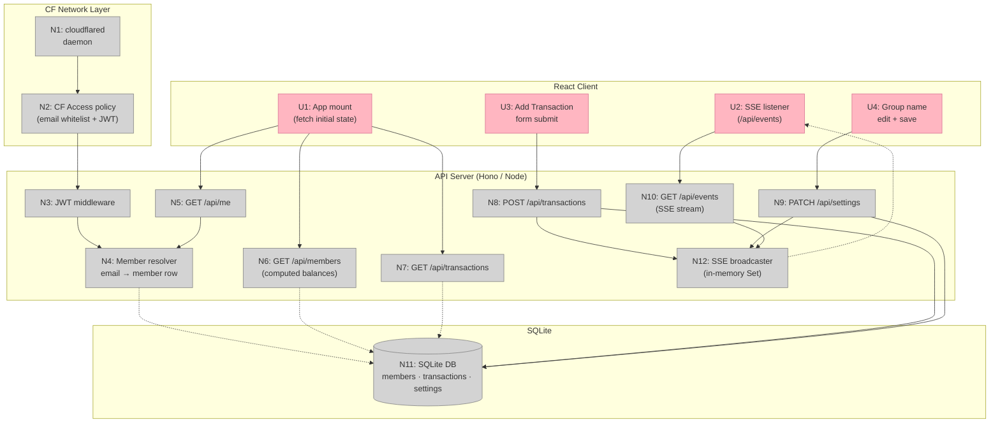

# Crunchtime — Server-Side Shaping Doc

## Frame

**Source:** React budget app (group fund tracker) with hardcoded mock data, no persistence.

**Problem:** Data resets on page reload. Multiple members cannot share a live view. No backend exists.

**Outcome:** A real backend serving the app from a personal machine, accessible via Cloudflare Tunnel. Only designated group members can access it. Changes persist and sync in real time.

---

## Requirements

| Req | Requirement | Status |
|-----|-------------|--------|
| R0 | Every group member has an individual account and can log in | Must-have |
| R1 | Transactions, members, and balances persist in a database across sessions | Must-have |
| R2 | All logged-in members share the same live group state | Must-have |
| R3 | When one member adds a transaction, others see it without manually refreshing | Must-have |
| R4 | The app is self-hosted on your machine and reachable from the internet via Cloudflare Tunnel | Must-have |
| R5 | There is one group/fund — no multi-tenancy | Core constraint |
| R6 | Auth must be secure enough that only designated members can access financial data | Must-have |
| R7 | Server should be maintainable by one person without ops overhead | Must-have |

---

## Shapes

### Shape A — Cloudflare Access auth ✅ Selected

Cloudflare's zero-trust layer sits in front of the server. Members log in via Cloudflare's UI (email OTP, Google, GitHub). Server verifies a signed JWT header (`CF-Access-Jwt-Assertion`) injected by Cloudflare. No auth UI to build.

Members are **seeded manually** into the DB at setup. CF Access email whitelist and DB membership are kept in sync by the operator.

**Components:**
- A1: Hono API server on Node.js
- A2: `better-sqlite3` for SQLite
- A3: Cloudflare Access policy (members whitelisted by email)
- A4: Server-Sent Events for real-time push
- A5: `cloudflared` tunnel daemon

### Shape B — App-managed auth

Not selected. Requires building login UI, session/JWT handling, password storage, and password reset. Too much ongoing maintenance for a single-operator personal project. Fails R7.

---

## Fit Check

| Req | Requirement | Status | A (CF Access) | B (App auth) |
|-----|-------------|--------|:---:|:---:|
| R0 | Every member has an individual account and can log in | Must-have | pass | pass |
| R1 | Transactions, members, and balances persist across sessions | Must-have | pass | pass |
| R2 | All members share the same live group state | Must-have | pass | pass |
| R3 | New transactions appear for others without a manual refresh | Must-have | pass | pass |
| R4 | Self-hosted on your machine, reachable via Cloudflare Tunnel | Must-have | pass | pass |
| R5 | Single group, no multi-tenancy | Core constraint | pass | pass |
| R6 | Only designated members can access financial data | Must-have | pass | pass |
| R7 | Maintainable by one person without ops overhead | Must-have | pass | fail |

**Notes:**
- R7/B fail: App-managed auth means building and maintaining login UI, password reset, session storage, and security hardening — ongoing ops for a personal project.
- R6/A: CF Access email whitelist is a dashboard click. Removing a member's access requires no code changes.

---

## Detail A: Breadboard

### UI Affordances

| ID | Place | Affordance | Wires Out |
|----|-------|-----------|-----------|
| U1 | React Client | App mount — fetch initial state | → N5, N6, N7 |
| U2 | React Client | SSE listener — subscribes to `/api/events`, applies incoming events to local state | → N10 |
| U3 | React Client | Add Transaction form submit | → N8 |
| U4 | React Client | Group name edit + save | → N9 |

### Non-UI Affordances

| ID | Place | Affordance | Wires Out |
|----|-------|-----------|-----------|
| N1 | CF Network | `cloudflared` daemon — tunnels `https://yourapp.domain` → `localhost:3000` | → N2 |
| N2 | CF Network | CF Access policy — email whitelist; injects `CF-Access-Jwt-Assertion` header | → N3 |
| N3 | API Server | JWT middleware — verifies CF header on every request, extracts email | → N4 |
| N4 | API Server | Member resolver — looks up member row by email from JWT | → N11 |
| N5 | API Server | `GET /api/me` — returns current member | → N4 |
| N6 | API Server | `GET /api/members` — returns all members with computed balances (sum from transactions) | → N11 |
| N7 | API Server | `GET /api/transactions` — returns all transactions sorted by date desc | → N11 |
| N8 | API Server | `POST /api/transactions` — validates, writes transaction, broadcasts SSE event | → N11, N12 |
| N9 | API Server | `PATCH /api/settings` — updates group name | → N11, N12 |
| N10 | API Server | `GET /api/events` — SSE stream, registers client in broadcaster | → N12 |
| N11 | SQLite | DB — `members`, `transactions`, `settings` tables | |
| N12 | API Server | SSE broadcaster — in-memory `Set` of active connections, fans out on write | → U2 |

### DB Schema

```
members       id · name · initials · phone · email · color
              (no balance column — computed on read from transactions)

transactions  id · description · amount · member_id · date · category · edit_history (JSON)

settings      key · value
              seed: group_name = 'Crunch Fund'
```

### SSE Event Shape

```
event: transaction_added
data: { id, description, amount, memberId, date, category }

event: settings_updated
data: { groupName }
```

### Member Seeding

Members are seeded manually at setup via a seed script. No auto-provisioning. The operator is responsible for keeping the CF Access email whitelist and the `members` table in sync.

### Wiring Diagram



**Legend:**
- **Pink nodes (U)** = UI affordances (things users see/interact with)
- **Grey nodes (N)** = Code affordances (data stores, handlers, services)
- **Solid lines** = Wires Out (calls, triggers, writes)
- **Dashed lines** = Returns To (return values, reads)
