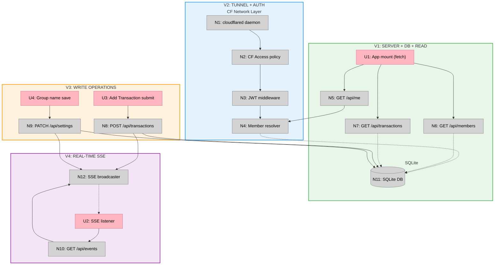

# Crunchtime — Server Slices

Shape selected: **A — Cloudflare Access + SQLite + SSE**

---

## Slices Grid

|  |  |
|:--|:--|
| **V1: Server + DB + Read**<br>⏳ PENDING<br><br>• Hono server + SQLite schema<br>• Seed script (members, transactions, settings)<br>• GET /api/members, /api/transactions, /api/me<br>• Wire React app to fetch from API<br><br>*Demo: App loads live data from server; reload and data is still there* | **V2: Tunnel + Auth**<br>⏳ PENDING<br><br>• cloudflared tunnel setup<br>• CF Access policy (email whitelist)<br>• JWT middleware (N3) + member resolver (N4)<br>• /api/me returns real identity from JWT<br><br>*Demo: App is live on internet; non-whitelisted email is blocked* |
| **V3: Write Operations**<br>⏳ PENDING<br><br>• POST /api/transactions (write + validate)<br>• PATCH /api/settings (group name)<br>• Wire Add Transaction form to API<br>• Wire group name editor to API<br><br>*Demo: Add a transaction, reload — it's still there. Change group name — persists.* | **V4: Real-time SSE**<br>⏳ PENDING<br><br>• GET /api/events SSE endpoint<br>• In-memory SSE broadcaster (N12)<br>• Broadcast on transaction write + settings update<br>• React SSE listener applies events to local state<br><br>*Demo: Two tabs open — add transaction in one, appears instantly in the other* |

---

## V1: Server + DB + Read

**Affordances:**

| ID | Affordance | Notes |
|----|-----------|-------|
| N11 | SQLite DB — create schema: `members`, `transactions`, `settings` | Use `better-sqlite3`; schema applied on server start |
| N11-seed | Seed script — populate members from mock data, seed `group_name` setting | One-time script: `node seed.js` |
| N6 | `GET /api/members` — all members with computed balances | `SELECT id, name, initials, phone, email, color, (SELECT SUM(amount) FROM transactions WHERE member_id = members.id) as balance FROM members` |
| N7 | `GET /api/transactions` — all transactions sorted by date desc | `SELECT * FROM transactions ORDER BY date DESC` |
| N5 | `GET /api/me` — stub returning first member (no auth yet) | Replaced by real JWT lookup in V2 |
| U1 | React app mount — fetch members, transactions, and current user on mount | `BudgetApp.tsx`: change `useState(MEMBERS)` → `useState<Member[]>([])` and `useState(TRANSACTIONS)` → `useState<Transaction[]>([])`; add `useEffect` fetching N6, N7, N5 in parallel. Drop `MEMBERS`/`TRANSACTIONS` constant imports from `data/mockData.ts`; keep `Member`/`Transaction` type imports. `groupName` stays hardcoded as `'Crunch Fund'` in V1 — no GET /api/settings until V3. |

**File changes:**
- New: `server/index.ts` — Hono server entry point
- New: `server/db.ts` — DB connection + schema creation
- New: `server/seed.ts` — seed script; use `MEMBERS`/`TRANSACTIONS` from `data/mockData.ts` as seed source
- New: `server/routes/members.ts`
- New: `server/routes/transactions.ts`
- New: `server/routes/me.ts`
- Changed: `pages/BudgetApp.tsx` — remove `MEMBERS`/`TRANSACTIONS` imports; `useState([])` for both; add `useEffect` fetch on mount

---

## V2: Tunnel + Auth

**Affordances:**

| ID | Affordance | Notes |
|----|-----------|-------|
| N1 | `cloudflared` tunnel — expose `localhost:3000` via named tunnel | Config in `~/.cloudflared/config.yml`; run as background process |
| N2 | CF Access policy — Application created in Cloudflare dashboard, email whitelist | No code; operator sets up in dashboard |
| N3 | JWT middleware — verify `CF-Access-Jwt-Assertion` header on every request | Fetch CF public keys from `https://<team>.cloudflareaccess.com/cdn-cgi/access/certs`; verify with `jose` |
| N4 | Member resolver — map `email` from JWT payload to `members` row | `SELECT * FROM members WHERE email = ?`; 403 if not found |
| N5 | `GET /api/me` — now uses N3+N4 to return real member | Replaces V1 stub |

**File changes:**
- New: `server/middleware/auth.ts` — JWT verification + member resolver
- Changed: `server/routes/me.ts` — use real member from middleware
- Changed: `server/index.ts` — register auth middleware globally
- New: `cloudflared/config.yml` — tunnel configuration (checked in, secrets excluded)

---

## V3: Write Operations

**Affordances:**

| ID | Affordance | Notes |
|----|-----------|-------|
| N8 | `POST /api/transactions` — validate body, write to DB | Validate: amount is number, description is non-empty string; generate id server-side |
| N9 | `PATCH /api/settings` — update `group_name` in settings table | Body: `{ groupName: string }` |
| N9-read | `GET /api/settings` — return `group_name` from settings table | Called on mount in V3 to replace hardcoded `'Crunch Fund'` from V1 |
| U3 | Add Transaction form — POST to `/api/transactions` on submit | `AddTransactionSheet.tsx:handleSubmit`: replace `onAdd({ ...id: Math.random()... })` with `fetch('/api/transactions', { method: 'POST', body: JSON.stringify({ amount, description, memberId, date, category }) })`; drop local ID generation (server assigns). On success, call `onClose()`; `BudgetApp.tsx:handleAddTransaction` triggers refetch of N6+N7 (replaced by SSE in V4). |
| U4 | Group name editor — PATCH to `/api/settings` on save | `SettingsTab.tsx:handleSaveName`: call `fetch('/api/settings', { method: 'PATCH', ... })` then call `onGroupNameChange(trimmed)` for immediate UI update. `BudgetApp.tsx` still wires `onGroupNameChange={setGroupName}`; SSE replaces this in V4. Also add `GET /api/settings` fetch on mount in `BudgetApp.tsx` to load persisted name. |

**File changes:**
- New: `server/routes/transactions.ts` — add POST handler
- New: `server/routes/settings.ts` — GET + PATCH handlers
- Changed: `components/AddTransactionSheet.tsx` — `handleSubmit`: replace `onAdd({...})` with POST fetch; drop local ID generation; call `onClose()` on success
- Changed: `components/SettingsTab.tsx` — `handleSaveName`: PATCH fetch before calling `onGroupNameChange`
- Changed: `pages/BudgetApp.tsx` — add `GET /api/settings` fetch on mount for `groupName`; change `handleAddTransaction` to refetch transactions + members after write

---

## V4: Real-time SSE

**Affordances:**

| ID | Affordance | Notes |
|----|-----------|-------|
| N10 | `GET /api/events` — SSE endpoint; registers response in broadcaster | Set headers: `Content-Type: text/event-stream`, `Cache-Control: no-cache`; remove on close |
| N12 | SSE broadcaster — module-level `Set<ServerResponse>`; `broadcast(event, data)` helper | Called by N8 and N9 after DB write |
| N8+ | POST /api/transactions — after write, call `broadcast('transaction_added', tx)` | Extends V3 handler |
| N9+ | PATCH /api/settings — after write, call `broadcast('settings_updated', { groupName })` | Extends V3 handler |
| U2 | React SSE listener — `EventSource('/api/events')` in `BudgetApp.tsx` | `useEffect`: `new EventSource('/api/events')`; on `transaction_added` → prepend tx to `transactions` state and recompute affected member's `balance` (same logic as the removed `handleAddTransaction`); on `settings_updated` → call `setGroupName`. Remove V3 post-write refetch from `handleAddTransaction`. Remove `onGroupNameChange` call from `SettingsTab.handleSaveName` success path. |

**File changes:**
- New: `server/sse.ts` — broadcaster module (`Set` + `broadcast` function)
- New: `server/routes/events.ts` — SSE endpoint
- Changed: `server/routes/transactions.ts` — import broadcaster, call after write
- Changed: `server/routes/settings.ts` — import broadcaster, call after write
- Changed: `pages/BudgetApp.tsx` — add `useEffect` SSE listener; remove post-write refetch from `handleAddTransaction`; `setGroupName` now driven by SSE event instead of `onGroupNameChange` prop

---

## Sliced Breadboard



**Legend:**
- **Pink nodes (U)** = UI affordances
- **Grey nodes (N)** = Code affordances
- **Green boundary** = V1 · **Blue** = V2 · **Orange** = V3 · **Purple** = V4
- **Solid lines** = Wires Out · **Dashed lines** = Returns To

---

## FE Source Reference

Current state of all FE files touched by slices. These are the starting point before any server wiring.

### `pages/BudgetApp.tsx`
*Touched in: V1 (U1), V3 (U3, U4), V4 (U2)*

```tsx
import React, { useState } from 'react'
import { MEMBERS, TRANSACTIONS, Transaction } from '../data/mockData'
import { BalanceHeader } from '../components/BalanceHeader'
import { TabBar } from '../components/TabBar'
import { HomeTab } from '../components/HomeTab'
import { FeedTab } from '../components/FeedTab'
import { MembersTab } from '../components/MembersTab'
import { AnalyticsTab } from '../components/AnalyticsTab'
import { SettingsTab } from '../components/SettingsTab'
import { AddTransactionSheet } from '../components/AddTransactionSheet'
export function BudgetApp() {
  const [activeTab, setActiveTab] = useState('home')
  const [isSheetOpen, setIsSheetOpen] = useState(false)
  const [transactions, setTransactions] = useState<Transaction[]>(TRANSACTIONS)
  const [members, setMembers] = useState(MEMBERS)
  const [groupName, setGroupName] = useState('Crunch Fund')
  const [isDark, setIsDark] = useState(false)
  const totalBalance = members.reduce((sum, m) => sum + m.balance, 0)
  const handleAddTransaction = (newTransaction: Transaction) => {
    setTransactions([newTransaction, ...transactions])
    // Update member balance
    setMembers(
      members.map((m) => {
        if (m.id === newTransaction.memberId) {
          return {
            ...m,
            balance: m.balance + newTransaction.amount,
          }
        }
        return m
      }),
    )
  }
  return (
    <div
      className={`min-h-screen font-sans selection:bg-gray-200 ${isDark ? 'dark bg-gray-950 text-white' : 'bg-white text-black'}`}
    >
      <div className="max-w-md mx-auto min-h-screen relative flex flex-col">
        {activeTab !== 'home' && (
          <BalanceHeader
            balance={totalBalance}
            onAddTransaction={() => setIsSheetOpen(true)}
          />
        )}

        <main className="flex-1 flex flex-col">
          {activeTab === 'home' && (
            <HomeTab
              members={members}
              transactions={transactions}
              balance={totalBalance}
              onAddTransaction={() => setIsSheetOpen(true)}
              groupName={groupName}
            />
          )}
          {activeTab === 'activity' && (
            <FeedTab transactions={transactions} members={members} />
          )}
          {activeTab === 'members' && <MembersTab members={members} />}
          {activeTab === 'analytics' && (
            <AnalyticsTab members={members} transactions={transactions} />
          )}
          {activeTab === 'settings' && (
            <SettingsTab
              members={members}
              groupName={groupName}
              onGroupNameChange={setGroupName}
              isDark={isDark}
              onToggleDark={() => setIsDark((d) => !d)}
            />
          )}
        </main>

        <TabBar activeTab={activeTab} onTabChange={setActiveTab} />

        <AddTransactionSheet
          isOpen={isSheetOpen}
          onClose={() => setIsSheetOpen(false)}
          members={members}
          onAdd={handleAddTransaction}
        />
      </div>
    </div>
  )
}
```

---

### `components/AddTransactionSheet.tsx`
*Touched in: V3 (U3)*

```tsx
import React, { useState, useRef } from 'react'
import { motion, AnimatePresence } from 'framer-motion'
import { XIcon } from 'lucide-react'
import { Button } from './ui/Button'
import { Input } from './ui/Input'
import { Member } from '../data/mockData'
interface AddTransactionSheetProps {
  isOpen: boolean
  onClose: () => void
  members: Member[]
  onAdd: (transaction: any) => void
}
export function AddTransactionSheet({
  isOpen,
  onClose,
  members,
  onAdd,
}: AddTransactionSheetProps) {
  const [amount, setAmount] = useState('')
  const [description, setDescription] = useState('')
  const [selectedMember, setSelectedMember] = useState(members[0].id)
  const [type, setType] = useState<'expense' | 'income'>('expense')
  const [showErrors, setShowErrors] = useState(false)
  const amountRef = useRef<HTMLInputElement>(null)
  const descriptionRef = useRef<HTMLInputElement>(null)
  const isValid =
    amount !== '' && parseFloat(amount) > 0 && description.trim() !== ''
  const handleSubmit = (e: React.FormEvent) => {
    e.preventDefault()
    if (!isValid) return
    onAdd({
      amount:
        type === 'expense'
          ? -Math.abs(parseFloat(amount))
          : Math.abs(parseFloat(amount)),
      description,
      memberId: selectedMember,
      date: new Date().toISOString(),
      category: 'General',
      id: Math.random().toString(36).substr(2, 9),
    })
    setAmount('')
    setDescription('')
    setShowErrors(false)
    onClose()
  }
  const handleCTAClick = () => {
    if (!isValid) {
      setShowErrors(true)
      if (!amount || parseFloat(amount) <= 0) {
        amountRef.current?.focus()
      } else if (!description.trim()) {
        descriptionRef.current?.focus()
      }
      return
    }
    const form = document.getElementById('transaction-form') as HTMLFormElement
    form?.requestSubmit()
  }
  // ... render (unchanged)
}
```

---

### `components/SettingsTab.tsx`
*Touched in: V3 (U4)*

```tsx
import React, { useState } from 'react'
// ... icon imports
import { Member } from '../data/mockData'
interface SettingsTabProps {
  members: Member[]
  groupName: string
  onGroupNameChange: (name: string) => void
  isDark: boolean
  onToggleDark: () => void
}
export function SettingsTab({
  members,
  groupName,
  onGroupNameChange,
  isDark,
  onToggleDark,
}: SettingsTabProps) {
  const [isEditingName, setIsEditingName] = useState(false)
  const [nameInput, setNameInput] = useState(groupName)
  const handleSaveName = () => {
    const trimmed = nameInput.trim()
    if (trimmed) onGroupNameChange(trimmed)   // ← V3: PATCH /api/settings here before calling onGroupNameChange
    setIsEditingName(false)
  }
  // ... render (unchanged)
}
```

---

### `data/mockData.ts`
*Used in: V1 seed script (N11-seed). `Member`/`Transaction` interfaces kept as types throughout.*

```ts
export interface Member {
  id: string
  name: string
  initials: string
  phone: string
  email: string
  color: string
  balance: number // positive = owed money, negative = owes money
}

export interface Transaction {
  id: string
  description: string
  amount: number // positive = income, negative = expense
  memberId: string
  date: string // ISO string
  category: string
  editHistory?: Array<{
    editedBy: string
    editedAt: string
    change: string
  }>
}

export const MEMBERS: Member[] = [ /* 12 members — see source */ ]
export const TRANSACTIONS: Transaction[] = [ /* 12 transactions — see source */ ]
```
